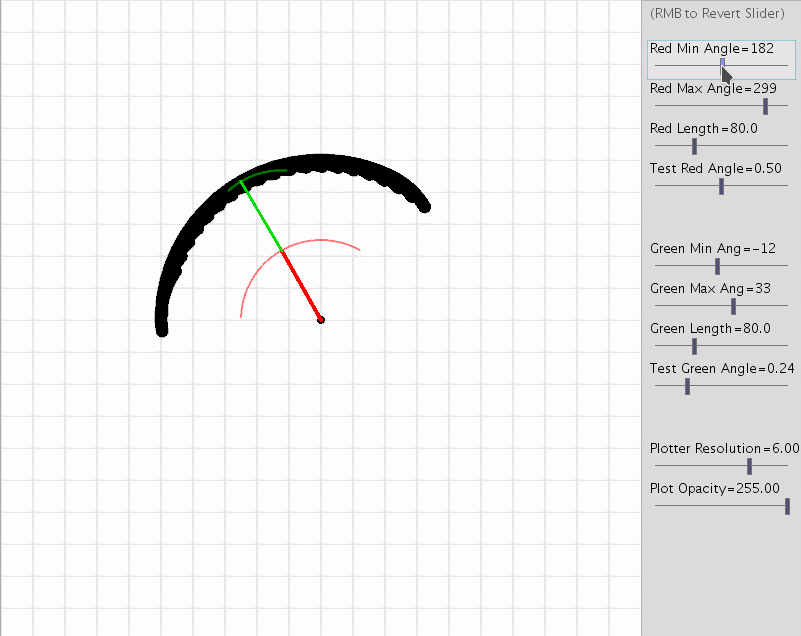

# IKPlotter
Processing (Java) plotter to determine the reach for a classic two-segment armature
Can be run from processing 3.5, Processing 4 or by making an executable (See example in the releases)

